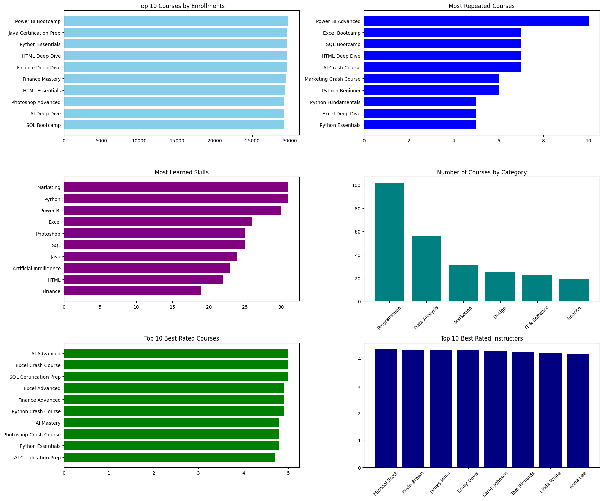
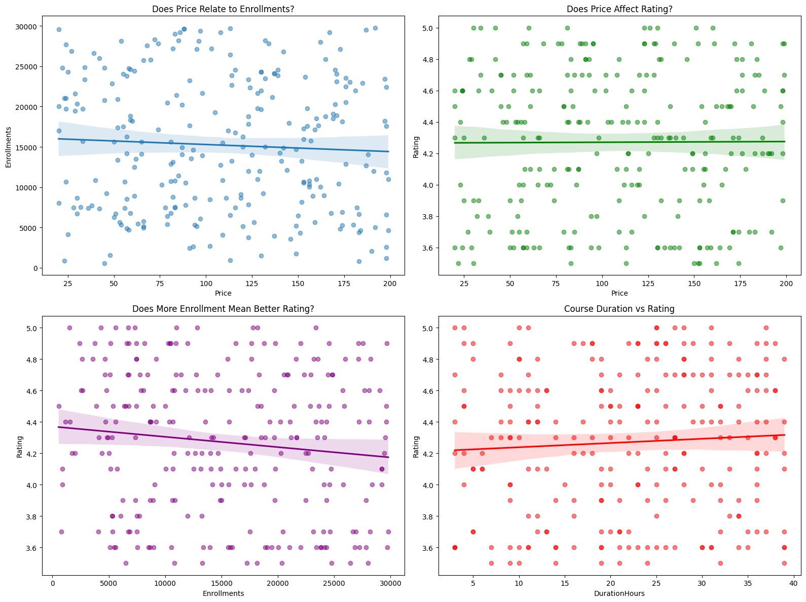

# 🎓 Online Courses Analysis

## 🧭 Project Goal
To analyze our data and determine the best-performing courses and instructors in order to make data-driven decisions that improve our services and course offerings.

## 🛠️ Tools Used
Python, Pandas, Matplotlib, Seaborn, Jupyter Notebook

[Click Here To Read The Jupyter Notebook For This Project](Project.ipynb)
---

## 🧹 Step 1 – Cleaning and Transforming the Data
A copy of the original DataFrame was created using the .copy() method to preserve the raw data.

### 1.1 Checking Duplicates
Used the .duplicated() method to detect duplicates and .drop_duplicates() to remove them if found.
✅ No duplicates were found.

### 1.2 Checking Null Values
Checked for missing data using .isna() and .sum().
✅ No null values were found.

### 1.3 Standardizing the Data
To ensure consistency, course names were reviewed for typos and variations (e.g., "SQL Essentials" vs "SQL Fundamentals").

No spelling errors were found, but course names varied in style.

A new column CourseNameShort was created using a custom function (def shorten_name) to detect keywords and group related courses under 10 unified skill labels (e.g., SQL, Python, Excel, etc.).

The Category column contained mostly incorrect values, so it was corrected using a dictionary mapping and the .map() function.

Lastly, a simplified Rating column was added by rounding ratings to the nearest whole number (1–5 scale).

✅ The data is now clean and ready for exploration.

---

## 🔍 Step 2 – Exploring the Data and Defining Key Questions

### 📈 Course Performance
- Which course has the highest enrollment?
- Which course was offered or repeated the most?
- Which category has the most courses?
- Which skill (based on CourseNameShort) do learners study the most?
- What is the best-rated course overall?

### 👨‍🏫 Instructor Performance
- Who is the best-rated instructor?
- Which instructor has the highest total enrollments?

### 💰 Price & Demand Relationships
- Does price correlate with enrollments?
- Does price affect course ratings?

### ⏱️ Course Duration & Quality
- Does course duration affect ratings?
- Are longer courses more popular (enrolled more) or not?

---

## 📊 Step 3 – Visualizations and Dashboards
Two dashboards were created using Matplotlib and Seaborn:

- **Dashboard 1 – Course Overview:** Focuses on course and instructor performance using bar charts and summary visuals.
- 
- **Dashboard 2 – Relationships:** Displays scatter plots to explore relationships between price, ratings, enrollments, and duration.

---

## 💡 Insights and Recommendations

### Key Insights:
- Power BI Bootcamp is our most successful course, followed closely by Python and Java.
- Power BI Advanced is the most frequently repeated course.
- Marketing and Python are the most popular skills among learners, while Finance is the least.
- Programming is our top category, with the largest number of courses.
- AI Advanced, Excel Crash Course, and SQL Certification Prep are all top-rated courses, each achieving 5 stars.
- Instructor performance is highly competitive, with Michael Scott leading by a small margin.
- Price has little to no effect on enrollments — a slightly negative trend was observed as prices increase.
- Price and Rating show no correlation.
- Enrollments tend to slightly decrease as ratings increase — a weak negative trend.
- Course Duration shows a slightly positive relationship with ratings (longer courses tend to be rated slightly higher).

### Recommendations:
1. Expand Power BI and Python content, as these are the most demanded and best-performing skills.
2. Offer more advanced and specialized versions of high-demand courses like SQL and AI.
3. Review pricing strategy — since price doesn't strongly impact enrollments, focus on content quality instead of discounts.
4. Encourage instructors like Michael Scott to mentor or train new instructors, as they consistently receive high ratings.
5. Invest in improving shorter courses, since longer ones slightly correlate with better ratings.
6. Diversify Finance and Design content, as it currently shows low learner interest and engagement.
